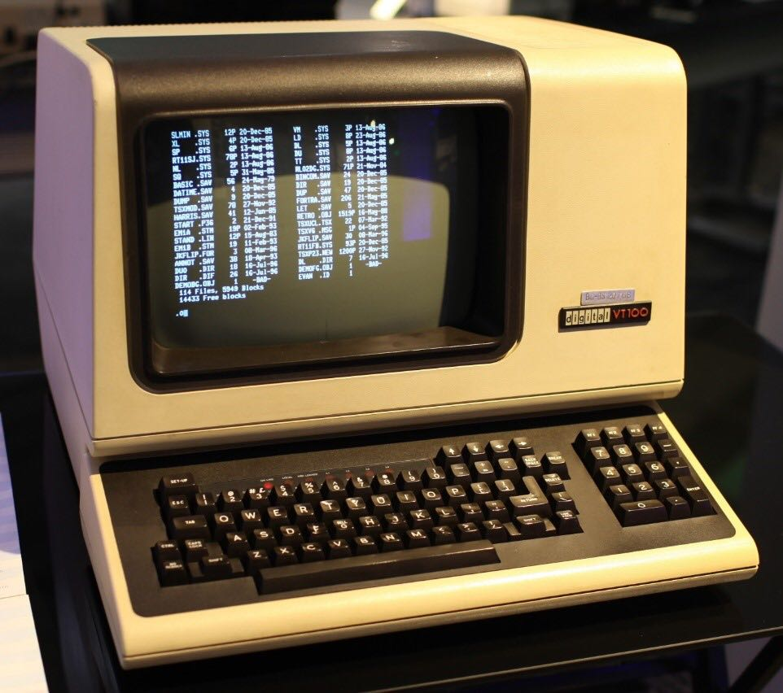
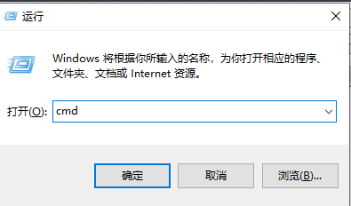
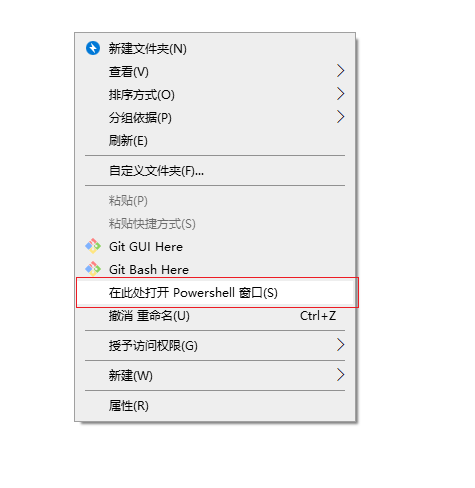

Windows Command Line Tutorial

Windows 系统常用的命令行命令


# 前言

刚接触 Stata 可能对命令行操作感到陌生，其实可以先学学常用的 Windows 命令行。不仅可以降低对命令行操作方式的距离感，还可以体验命令行操作的快感，提高工作流畅度。

[Windows Command-Line: Backgrounder](https://devblogs.microsoft.com/commandline/windows-command-line-backgrounder/)


## 操作方式

### Windows 控制台

#### 命令窗口

使用 `win+R` 快捷键打开 **运行** 对话框，输入 `cmd` 打开控制台命令窗口。也可以通过`cmd /c` 命令 和 `cmd /k` 命令的方式来直接运行命令。其中，`/c` 表示执行完命令后关闭 cmd 窗口；`/k` 表示执行完命令后保留 cmd 窗口。


在指定路径打开命令窗口：在目标路径空白处按住 `Shift` ，然后右键弹出快捷菜单，点击“在此处打开命令行窗口”（或者“在此处打开Powershell窗口”）。


### 其他技巧
- `command /?` 用于查看 command 命令的帮助说明；
- 中断命令执行：`Ctrl+Z`
- 使用上下方向键，查看使用过的命令；
- 使用 `Tab` 键补齐命令；
- 命令参数的路径要使用反斜杠 '\' ,如 `del d:\test2\file\my.txt`；
- 如果命令参数的路径存在空格，如某一文件夹名称包含空格，需使用双引号将路径引起来，如：`del "c:\my.txt"`。

### Stata 中

```
!cmd
shell cmd
```

# 基础操作

## 路径管理
```
cd
cd .\
cd ..\
ls
dir
```

（1）cd命令用于切换目录

 例：cd  //显示当前目录

 例：cd ..  //进入父目录

 例：cd /d d:  //进入上刺d盘所在的目录，其中cd /d 是固定的

 例：cd /d d:\  //进入d盘根目录，基本同上，d:\表示d盘根目录（或直接输入d:）

 例：cd d:  //显示上次d盘所在的目录

 例：cd /d d:\zsc  //进入d:\zsc目录，如果是进入子目录，直接输入cd 目录名即可,如cd zsc\didiao,即进入当前目录下的zsc\didiao文件夹

 （3）dir 显示目录中的内容

 例：dir //显示当前目录下的子文件夹与文件

 例：dir /b //只显示当前目录中的子文件夹与文件的文件名

 例：dir /p //分页显示

 例：dir /ad  // 显示当前目录中的子文件夹

 例：dir /a-d  // 显示当前目录中的文件

 例：dir c:\test   // 显示c:\test目录中的内容

 例：dir keys.txt  // 显示当前目录中keys.txt的信息

 例：dir /S   // 递归显示当前目录中的内容

 例：dir key*  // 显示当前目录下以key开头的文件和文件夹的信息

 例：dir /AH /OS  // 只显示当前目录中隐藏的文件和目录，并按照文件大小从小到大排序

（4）tree显示目录结构

 例：tree d:\myfiles  //显示d:\myfiles目录结构

（5）ren文件或目录重命名

 例：ren rec.txt rec.ini  // 将当前目录下的rec.txt文件重命名为rec.ini

 例：ren c:\test test_01  // 将c盘下的test文件夹重命名为test_01（test-01不需要完整的路径）

 例：ren Logs.txt Logs-%date:~0,4%%date:~5,2%%date:~8,2%_%time:~0,2%%time:~3,2%.txt  
 // 将当前目录下的Logs.txt文件重命名为Logs-20150114_2135.txt或Logs-20150114_ 812.txt
（注意：小时只有个位数时会多一个空格，可以使用字符串替换：将空格替换成0）

## 文件管理
```
mkdir
rmdir
type
cat
tree
echo
copy
xcopy
move
rename
del
replace
```

（1）cd命令用于切换目录

 例：cd  //显示当前目录

 例：cd ..  //进入父目录

 例：cd /d d:  //进入上刺d盘所在的目录，其中cd /d 是固定的

 例：cd /d d:\  //进入d盘根目录，基本同上，d:\表示d盘根目录（或直接输入d:）

 例：cd d:  //显示上次d盘所在的目录

 例：cd /d d:\zsc  //进入d:\zsc目录，如果是进入子目录，直接输入cd 目录名即可,如cd zsc\didiao,即进入当前目录下的zsc\didiao文件夹

（2）pushd popd 命令通过栈来维护当前目录

 md d:\mp3 // 在D:\建立mp3文件夹
 md d:\mp4 // 在D:\建立mp4文件夹
 cd /d d:\mp4 // 更改当前目录为d:\mp4
 pushd c:\mp3 // 将当前目录d:\mp4入栈，并切换当前目录为c:\mp3
 popd  // 将刚才保存的d:\mp4弹栈，并设置为当前目录

（3）dir 显示目录中的内容

 例：dir //显示当前目录下的子文件夹与文件

 例：dir /b //只显示当前目录中的子文件夹与文件的文件名

 例：dir /p //分页显示

 例：dir /ad  // 显示当前目录中的子文件夹

 例：dir /a-d  // 显示当前目录中的文件

 例：dir c:\test   // 显示c:\test目录中的内容

 例：dir keys.txt  // 显示当前目录中keys.txt的信息

 例：dir /S   // 递归显示当前目录中的内容

 例：dir key*  // 显示当前目录下以key开头的文件和文件夹的信息

 例：dir /AH /OS  // 只显示当前目录中隐藏的文件和目录，并按照文件大小从小到大排序

（4）tree显示目录结构

 例：tree d:\myfiles  //显示d:\myfiles目录结构

（5）ren文件或目录重命名

 例：ren rec.txt rec.ini  // 将当前目录下的rec.txt文件重命名为rec.ini

 例：ren c:\test test_01  // 将c盘下的test文件夹重命名为test_01（test-01不需要完整的路径）

 例：ren Logs.txt Logs-%date:~0,4%%date:~5,2%%date:~8,2%_%time:~0,2%%time:~3,2%.txt  
 // 将当前目录下的Logs.txt文件重命名为Logs-20150114_2135.txt或Logs-20150114_ 812.txt
（注意：小时只有个位数时会多一个空格，可以使用字符串替换：将空格替换成0）

（6）md 创建目录

 例：md movie music  //创建movie和music两个目录

 例：md d:\test\movie 

（7）rd 删除目录

 例：rd movie  //删除movie目录

 例：rd /s /q d:\test //使用安静模式删除d:\test（除自身目录外，还删除该目录下的所有目录和文件）

（8）copy 拷贝文件

 例:copy key.txt c:\doc //将当前目录下的key.txt文件拷贝到c:\doc目录下，如文件已存在会询问是否覆盖

 例：copy jobs c:\doc  // 将当前目录下jobs文件夹中文件（不递归子目录）拷贝到c:\doc下（若doc中也存在相应的文件，会询问是否覆盖）

 例：copy key.txt c:\doc\key_bak.txt  // 将当前目录下的key.txt拷贝到c:\doc下，并重命名为key_bak.txt（若doc中也存在一个key_bak.txt文件，会询问是否覆盖）

 例：copy /Y key.txt c:\doc  // 将当前目录下的key.txt拷贝到c:\doc下（不询问，直接覆盖写）

 例：copy key.txt +  // 复制文件到自己，实际上是修改了文件日期

 例：copy /Y key1.txt + key2.txt key.txt  // 将当前目录下的key1.txt与key2.txt的内容合并写入key.txt中（不询问，直接覆盖写）

 例：copy /B art_2.7z.* art_2.7z    // 将当前目录下的art_2.7z.开头的所有文件（按照名称升序排序）依次合并生成art_2.7z

 例：copy /B art_2.7z.001+art_2.7z.002 art_2.7z    // 将当前目录下的art_2.7z.001、art_2.7z.002文件合并生成art_2.7z

（9）xcopy 更强大的复制命令

 例：xcopy c:\bat\hai d:\hello\ /s /h /e /f /c    // 将c:\bat\hai中的所有内容拷贝到d:\hello中  注意：需要在hello后加上\  表示hello为一个目录，否则xcopy会询问hello是F，还是D

 例：xcopy c:\bat\hai d:\hello\ /d:12-29-2010  // 将c:\bat\hai中的2010年12月29日后更改的文件拷贝到d:\hello中

（10）move 移动文件

 例：move *.png test  // 将当前目录下的png图片移动到当前目录下test文件夹中 （若test中也存在同名的png图片，会询问是否覆盖）

 例：move /Y *.png test  // 将当前目录下的png图片移动到当前目录下test文件夹中 （不询问，直接覆盖写）

 例：move 1.png d:\test\2.png  // 将当前目录下的1.png移动到d盘test文件夹中，并重命名为2.png （若test中也存在同名的png图片，会询问是否覆盖）

 例：move test d:\new  // 若d盘中存在new文件夹，将当前目录下的test文件夹移动到d盘new文件夹中；若不存在，将当前目录下的test文件夹移动到d盘，并重命名为new

 del 删除文件   注意：目录及子目录都不会删除

 例：del test  // 删除当前目录下的test文件夹中的所有非只读文件（子目录下的文件不删除；删除前会进行确认；等价于del test\*）

 例：del /f test  // 删除当前目录下的test文件夹中的所有文件（含只读文件；子目录下的文件不删除；删除前会进行确认；等价于del /f test\*）

 例：del /f /s /q test d:\test2\*.doc  // 删除当前目录下的test文件夹中所有文件及d:\test2中所有doc文件（含只读文件；递归子目录下的文件；删除前不确认）

++++++++++++++++++++++

 /ar、/ah、/as、/aa 分别表示删除只读、隐藏、系统、存档文件
 /a-r、/a-h、/a-s、/a-a 分别表示删除除只读、隐藏、系统、存档以外的文件

++++++++++++++++++++++

（11）replace 替换文件（即使该文件正在使用，仍然可以替换成功）

 例：replace d:\love.mp3 d:\mp3\love.mp3   // 使用d盘下的love.mp3强制替换d盘mp3目录中的love.mp3文件

 

## 其他工具

|运行程序|运行命令|
|:---:|:---:|
|清除屏幕|`cls`|
|显示或设置当前日期|`date`|
|记事本|`notepad`|
|计算器|`calc`|
|画图|`mspaint`|
|写字板|`write`|
|Windows放大镜|`magnify`|
|辅助工具管理器|`utilman`|
|任务管理器|`taskmgr`|
|关闭Windows|`shutdown`|
|控制面板|`control`|
|屏幕键盘|`osk`|
|网络连接|`ncpa.cpl` 或 `control netconnections`|
|从Windows注销|`logoff`|
|字体文件夹|`fonts` 或 `control fonts`|
|命令行提示符|`cmd`|
|剪贴簿查看器|`clipbrd`|
|添加或删除程序|`appwiz.cpl`|


logoff  注销当前用户

shutdown  关闭、重启、注销、休眠计算机

例：shutdown /s  // 关闭计算机

例：shutdown /s /t 3600  // 一小时后，关闭本地计算机

例：shutdown /a  // 终止系统关闭

例：shutdown /r  // 关闭并重启本地计算机

例：shutdown /m 192.168.1.166 /r  // 关闭并重启ip为192.168.1.166的计算机


# 进阶操作

## 环境变量

## curl

## 计划任务

## 批处理

## 操作符
8.@#@

 （1）&  顺序执行多条命令，而不管命令是否执行成功

 例：cd /d d:\src&work.exe /o c:\result.txt  // 先将当前工作目录切换到d:\src下，然后执行work.exe /o c:\result.txt命令

 （2）&&  顺序执行多条命令，当碰到执行出错的命令后将不执行后面的命令

 例：find "ok" c:\test.txt && echo 成功 // 如果找到了"ok"字样，就显示"成功"，找不到就不显示

 （3）||   顺序执行多条命令，当碰到执行正确的命令后将不执行后面的命令

 例：find "ok" c:\test.txt || echo 不成功   // 如果找不到"ok"字样，就显示"不成功"，找到了就不显示

 （4）|    管道命令

 例：dir *.* /s/a | find /c ".exe"   

 // 先执行dir命令，然后对输出结果（stdout）执行find命令（输出当前文件夹及所有子文件夹里的.exe文件的个数）

 例：dir *.* /s/a 2>&1 | find /c ".exe"   

 // 先执行dir命令，然后对输出结果（stdout）和错误信息（stderr）执行find命令（输出当前文件夹及所有子文件夹里的.exe文件的个数）

（5）>  将当前命令输出以覆盖的方式重定向

 例：tasklist > p1.txt   // 将tasklist的输出结果（stdout）以覆盖的方式重定向到p1.txt文件中（注：tasklist的输出结果就不会打印到屏幕上了）

 例：tasklist 1> p1.txt  // 等同于：tasklist > p1.txt

 例：dir bin 2> p1.txt  // 输出结果（stdout）打印在屏幕上，错误信息（stderr）以覆盖的方式重定向到p1.txt中（注：bin目录不存在时，会输出错误信息）

 例：dir bin > p1.txt 2>&1  // 将错误信息（stderr）重定向到输出结果（stdout），然后将输出结果（stdout）以覆盖的方式重定向到p1.txt中（注：bin目录不存在时，会输出错误信息）

 例：dir bin 2> p1.txt 1>&2  // 将输出结果（stdout）重定向到错误信息（stderr），然后将错误信息（stderr）以覆盖的方式重定向到p1.txt中（注：bin目录不存在时，会输出错误信息） 注：与上条命令结果一致

 例：tasklist >nul   // 屏幕上不打印tasklist的输出结果（stdout），错误信息（stderr）仍会打印

 例：dir bin 2>nul   // 屏幕上不打印命令的错误信息（stderr），输出结果（stdout）仍会打印（注：bin目录不存在时，会输出错误信息）

 例：dir bin >nul 2>&1   //  将命令的错误信息（stderr）重定向到输出结果（stdout），然后不打印输出结果（stdout）【屏幕上错误信息（stderr）和输出结果（stdout）都不打印】（注：bin目录不存在时，会输出错误信息）

 例：dir bin 2>nul 1>&2   //  将命令的输出结果（stdout）重定向到错误信息（stderr），然后不打印错误信息（stderr）【屏幕上错误信息（stderr）和输出结果（stdout）都不打印】（注：bin目录不存在时，会输出错误信息）

（6）>>  将当前命令输出以追加的方式重定向

 例：tasklist >> p2.txt   // 将tasklist的输出结果（stdout）以追加的方式重定向到p2.txt文件中（注：tasklist的输出结果就不会打印到屏幕上了）

 例：tasklist 1>> p2.txt  // 等同于：tasklist >> p2.txt

 例：dir bin 2>> p2.txt  // 输出结果（stdout）打印在屏幕上，错误信息（stderr）以追加的方式重定向到p2.txt中（注：bin目录不存在时，会输出错误信息）

 例：dir bin >> p2.txt 2>&1  // 将错误信息（stderr）重定向到输出结果（stdout），然后将输出结果（stdout）以追加的方式重定向到p2.txt中（注：bin目录不存在时，会输出错误信息）

 例：dir bin 2>> p2.txt 1>&2  // 将输出结果（stdout）重定向到错误信息（stderr），然后将错误信息（stderr）以追加的方式重定向到p2.txt中（注：bin目录不存在时，会输出错误信息） 注：与上条命令结果一致

（7）<    从文件中获得输入信息，而不是从屏幕上，一般用于date time label等需要等待输入的命令

 例：date <temp.txt  // temp.txt中的内容为2005-05-01

（8）@   命令修饰符  在执行命令前，不打印出该命令的内容

 例：@cd /d d:\me   // 执行该命令时，不打印出命令的内容：cd /d d:/me

（9）,    在某些特殊的情况下可以用来代替空格使用

 例：dir,c:\   // 相当于：dir c:\

（10）;    当命令相同的时候,可以将不同的目标用;隔离开来但执行效果不变。如执行过程中发生错误则只返回错误报告但程序还是会继续执行

 例：dir c:\;d:\;e:\   // 相当于顺序执行：dir c:\    dir d:\     dir e:\

（11）echo.   // 输出一个"回车换行"，空白行

 echo off   // 后续所有命令在执行前，不打印出命令的内容

 echo on   // 后续所有命令在执行前，打印出命令的内容

 echo 123   // 输出123到终端屏幕

 echo "Hello World!!!"   // 输出Hello World!!!到终端屏幕

 echo %errorlevel%   // 每个命令运行结束，可以用这个命令行格式查看返回码；默认值为0，一般命令执行出错会设errorlevel为1

 echo test > p1.txt  // 输出test的字符串到当前目录中的p1.txt文件中（以覆盖的方式）

 set  // 显示当前用户所有的环境变量

 set path // 查看path的环境变量值（准确的说是查看以path开头的环境变量）

 set path=    // 清空path变量

 set path=d:\execute  // 将path变量设置为d:\execute（注：修改的path只会影响当前回话，也不会存储到系统配置中去；当前cmd窗口关闭，新设置的path也就不存在了）

 set path=%path%;d:\execute   // 在path变量中添加d:\execute（注：修改的path只会影响当前回话，也不会存储到系统配置中去；当前cmd窗口关闭，新设置的path也就不存在了）

 path // 显示当前path变量的值

 path ; // 清除所有搜索路径设置并指示cmd.exe只在当前目录中搜索

 path d:\xxx;%PATH%  // 将d:\xxx路径添加到path中

---------------------------------------------------

 set p=aa1bb1aa2bb2 // 设置变量p，并赋值为aa1bb1aa2bb2

 echo %p% // 显示变量p代表的字符串，即aa1bb1aa2bb2

 echo %p:~6% // 显示变量p中第6个字符以后的所有字符，即aa2bb2

 echo %p:~6,3% // 显示第6个字符以后的3个字符，即aa2

 echo %p:~0,3% // 显示前3个字符，即aa1

 echo %p:~-2% // 显示最后面的2个字符，即b2

 echo %p:~0,-2% // 显示除了最后2个字符以外的其它字符，即aa1bb1aa2b

 echo %p:aa=c% // 用c替换变量p中所有的aa，即显示c1bb1c2bb2

 echo %p:aa=% // 将变量p中的所有aa字符串置换为空，即显示1bb12bb2

 echo %p:*bb=c% // 第一个bb及其之前的所有字符被替换为c，即显示c1aa2bb2

 set p=%p:*bb=c% // 设置变量p，赋值为 %p:*bb=c% ，即c1aa2bb2

 set /a p=39 // 设置p为数值型变量，值为39

 set /a p=39/10 // 支持运算符，有小数时用去尾法，39/10=3.9，去尾得3，p=3

 set /a p=p/10 // 用 /a 参数时，在 = 后面的变量可以不加%直接引用

 set /a p="1&0" // &运算要加引号。其它支持的运算符参见set/?


（12）cls  清除屏幕

ver  显示当前windows系统的版本号

winver  弹框显示当前windows系统信息

vol  显示当前分区的卷标

label  显示当前分区的卷标，同时提示输入新卷标

label c:system  设置c盘的卷标为system

time  显示或设置当前时间

例：time /t  // 显示当前时间

例：time   // 设置新的当前时间（格式：hh:mm:ss），直接回车则表示放弃设置

date  显示或设置当前日期

例：date /t  // 显示当前日期

例：date   // 设置新的当前日期（格式：YYYY/MM/DD），直接回车则表示放弃设置

title 正在做命令行测试  // 修改当前cmd窗口的标题栏文字为正在做命令行测试

prompt orz:   // 将命令提示符修改为orz:

print 1.txt  // 使用设置好的打印机来打印1.txt文本文件

call ff.bat   // 调用执行ff.bat脚本（ff.bat脚本执行完原脚本才会往下执行）

start  运行某程序或命令

例：start /max notepad.exe  // 最大化的方式启动记事本

例：start /min calc.exe   // 最小化的方式启动计算器

例：start  tasklist  // 启动一个cmd实例窗口，并运行tasklist

例：start explorer f:\  // 调用资源管理器打开f盘

例：strat iexplore "www.qq.com"  // 启动ie并打开www.qq.com网址

例：start ff.bat  // 启动开始执行ff.bat（启动ff.bat脚本后，原脚本继续执行，不会等ff.bat脚本执行完）

exit  退出当前cmd窗口实例

例：exit 0  // 退出当前cmd窗口实例，并将过程退出代码设置为0（0表示成功，非0表示失败）

例：exit /B 1  // 退出当前bat脚本，并将ERRORLEVEL系统变量设置为1

pause   暂停批处理程序，并显示出：请按任意键继续....

color  设置当前cmd窗口背景色和前景色（前景色即为字体的颜色）

例：color  // 恢复到缺省设置

例：color 02 // 将背景色设为黑色，将字体设为绿色

--------------------------------------
0 = 黑色 8 = 灰色
1 = 蓝色 9 = 淡蓝色
2 = 绿色 A = 淡绿色
3 = 浅绿色 B = 淡浅绿色
4 = 红色 C = 淡红色
5 = 紫色 D = 淡紫色
6 = 黄色 E = 淡黄色
7 = 白色 F = 亮白色
--------------------------------------

10.进程操作

tasklist  // 显示当前运行的进程信息（可查看PID）

taskkill  结束指定的进程

例：taskkill /im notepad.exe  // 结束名为notepad.exe的进程

例：taskkill /pid 1230 /pid 1241 /pid 1253 /t // 结束pid为1230、1241和1253的进程以及由它们启动起来的子进程

例：taskkill /f /im cmd.exe /t   // 强制结束有名为cmd.exe的进程以及由它启动起来的子进程

## 文本处理
11.文本处理

edit config.ini  // 编辑config.ini文件（会进入edit字符编辑器；按alt，可以选择对应的菜单） win7 x64下没有该命令

find  文件中搜索字符串

例：find /N /I "pid" 1.txt  // 在1.txt文件中忽略大小写查找pid字符串，并带行号显示查找后的结果

例：find /C "exe" 1.txt  // 只显示在1.txt文件中查找到exe字符串的次数

例：find /V "exe" 1.txt  // 显示未包含1.txt文件中未包含exe字符串的行

findstr  文件中搜索字符串

例：findstr "hello world" 1.txt  // 在1.txt文件中搜索hello或world

例：findstr /c:"hello world" 1.txt  // 在1.txt文件中搜索hello world

例：findstr /c:"hello world" 1.txt nul  // 在1.txt文件中搜索hello world，并在每行结果前打印出1.txt:   注：findstr只有在2个及以上文件中搜索字符串时才会打印出每个文件的文件名，nul表示一个空文件

例：findstr /s /i "Hello" *.*   // 不区分大小写，在当前目录和所有子目录中的所有文件中的hello

例：findstr  "^[0-9][a-z]" 1.txt  // 在1.txt中搜索以1个数字+1个小写字母开头子串的行
